# 🎓 Guía Completa de Uso y Manual de Operaciones por Roles
## Sistema de Gestión y Calificaciones Académicas

Bienvenido a la **Guía Oficial de Usuario del Sistema de Calificaciones Académicas**. Este documento describe detalladamente la arquitectura funcional del sistema, el propósito de cada módulo, y el flujo de trabajo paso a paso adaptado a cada uno de los tres roles disponibles: **Administrador**, **Maestro (Docente)** y **Estudiante (Alumno)**.

---

## 📑 Tabla de Contenidos
1. [Objetivo General del Sistema](#-1-objetivo-general-del-sistema)
2. [Arquitectura y Matriz de Permisos](#-2-arquitectura-y-matriz-de-permisos)
3. [Inicio de Sesión y Autenticación](#-3-inicio-de-sesión-y-autenticación)
4. [Módulo del Administrador](#-4-módulo-del-administrador)
   - [4.1 Panel de Control (Dashboard Admin)](#41-panel-de-control-dashboard-admin)
   - [4.2 Gestión de Usuarios](#42-gestión-de-usuarios)
   - [4.3 Gestión de Asignaturas](#43-gestión-de-asignaturas)
   - [4.4 Gestión de Grupos Académicos](#44-gestión-de-grupos-académicos)
   - [4.5 Gestión de Matriculaciones (Inscripciones)](#45-gestión-de-matriculaciones-inscripciones)
5. [Módulo del Docente (Maestro)](#-5-módulo-del-docente-maestro)
   - [5.1 Panel del Docente (Teacher Dashboard)](#51-panel-del-docente-teacher-dashboard)
   - [5.2 Mis Grupos Asignados](#52-mis-grupos-asignados)
   - [5.3 Ficha Detallada del Grupo y Gestión de Actividades](#53-ficha-detallada-del-grupo-y-gestión-de-actividades)
   - [5.4 Calificación y Retroalimentación de Entregas](#54-calificación-y-retroalimentación-de-entregas)
6. [Módulo del Estudiante (Alumno)](#-6-módulo-del-estudiante-alumno)
   - [6.1 Portal del Estudiante (Student Dashboard)](#61-portal-del-estudiante-student-dashboard)
   - [6.2 Mi Grupo Académico](#62-mi-grupo-académico)
   - [6.3 Mis Asignaturas y Contacto Docente](#63-mis-asignaturas-y-contacto-docente)
   - [6.4 Mis Calificaciones e Historial de Evaluaciones](#64-mis-calificaciones-e-historial-de-evaluaciones)
7. [Flujo Operativo Integrado del Ciclo Escolar](#-7-flujo-operativo-integrado-del-ciclo-escolar)
8. [Preguntas Frecuentes y Solución de Problemas](#-8-preguntas-frecuentes-y-solución-de-problemas)

---

## 🎯 1. Objetivo General del Sistema

El **Sistema de Calificaciones Académicas** tiene como objetivo primordial digitalizar, centralizar y optimizar todos los procesos formativos y de evaluación continua en instituciones educativas de nivel secundario, técnico o universitario.

### ¿Qué problemas resuelve el sistema?
* **Eliminación del rezago manual:** Reemplaza planillas físicas o archivos de cálculo dispersos por una base de datos unificada en tiempo real.
* **Transparencia en el proceso evaluativo:** Los estudiantes conocen oportunamente sus calificaciones, porcentajes de avance y las observaciones cualitativas formuladas por sus profesores.
* **Control operativo institucional:** Los administradores pueden coordinar qué materias se ofrecen, qué docentes están a cargo de cada sección y qué alumnos integran formalmente cada aula.
* **Seguridad y privacidad de la información:** Mecanismo de autenticación basado en **JWT (JSON Web Tokens)** con rutas protegidas que impiden el acceso no autorizado a información sensible o calificaciones ajenas.

---

## 🔐 2. Arquitectura y Matriz de Permisos

El sistema implementa un modelo de **Control de Acceso Basado en Roles (RBAC - Role-Based Access Control)** con tres perfiles bien diferenciados:

| Característica / Capacidad | Administrador (`Admin`) | Docente (`Maestro`) | Estudiante (`Estudiante`) |
| :--- | :---: | :---: | :---: |
| **Acceso a Dashboard Institucional Global** | ✅ Total | ❌ | ❌ |
| **Crear, Editar y Eliminar Usuarios** | ✅ Total | ❌ | ❌ |
| **Crear y Administrar Catálogo de Asignaturas** | ✅ Total | ❌ | ❌ |
| **Crear Grupos y Asignar Docentes** | ✅ Total | ❌ | ❌ |
| **Matricular y Desmatricular Estudiantes** | ✅ Total | ❌ | ❌ |
| **Ver Dashboard de Rendimiento Docente** | ✅ Total | ✅ Grupos Propios | ❌ |
| **Crear y Modificar Actividades / Tareas** | ❌ | ✅ Grupos Propios | ❌ |
| **Asignar Calificaciones y Retroalimentación** | ❌ | ✅ Grupos Propios | ❌ |
| **Consultar Lista de Alumnos del Curso** | ✅ Total | ✅ Grupos Propios | ✅ Compañeros |
| **Consultar Historial Propio de Calificaciones** | ❌ | ❌ | ✅ Solo Propias |
| **Consultar Contactos de Profesores Asignados** | ✅ Directorio | ❌ | ✅ De sus materias |

---

## 🔑 3. Inicio de Sesión y Autenticación

Toda interacción con el sistema inicia en la pantalla unificada de **Inicio de Sesión** (`/login`).

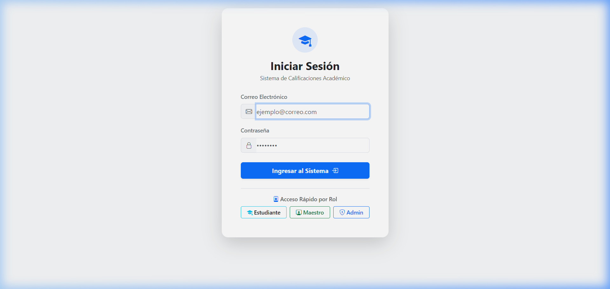

### Pasos para Ingresar al Sistema:
1. **Acceso Tradicional con Credenciales:**
   - Ingrese su **Correo Electrónico** institucional registrado (Ejemplo: `admin@colegio.edu`, `carlos.ramirez@institucion.edu` o `ana.gomez@colegio.edu`).
   - Ingrese su **Contraseña** secreta.
   - Haga clic en el botón azul **Ingresar al Sistema**.
   - El sistema validará sus credenciales contra el servidor backend ASP.NET Core y generará un token criptográfico JWT almacenado en memoria segura.
2. **Acceso Rápido por Rol (Demostración / Testing Institucional):**
   - En la parte inferior de la tarjeta se encuentran tres botones de acceso instantáneo:
     * **Estudiante:** Inicia sesión automáticamente con el perfil de un alumno.
     * **Maestro:** Inicia sesión con el perfil de un docente tutor.
     * **Admin:** Inicia sesión con privilegios totales de administración.
3. **Redirección Automática:**
   - Según el rol decodificado en el token, el sistema redirige automáticamente a la sección correspondiente:
     * `/admin` para Administradores.
     * `/maestro` para Docentes.
     * `/estudiante` para Alumnos.

---

## 🛡️ 4. Módulo del Administrador

El Administrador es la máxima autoridad del sistema, responsable de la configuración del catálogo académico y la estructura institucional.

### 4.1 Panel de Control (Dashboard Admin)
Ruta: `/admin`

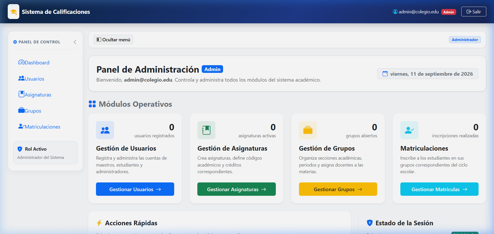

* **¿Para qué sirve?:** Ofrece una visión panorámica y en tiempo real del estado de la institución educativa.
* **Métricas Principales:**
  1. **Usuarios Registrados:** Conteo total de cuentas (Administradores, Maestros y Estudiantes).
  2. **Asignaturas Activas:** Cantidad de materias curriculares dadas de alta.
  3. **Grupos Abiertos:** Secciones académicas operando en el ciclo escolar vigente.
  4. **Matrículas Realizadas:** Total de inscripciones formales de alumnos en grupos.
* **Acciones Rápidas:** Botones directos con iconos para crear un usuario, una asignatura, un grupo o una inscripción con un solo clic.

---

### 4.2 Gestión de Usuarios
Ruta: `/admin/usuarios`

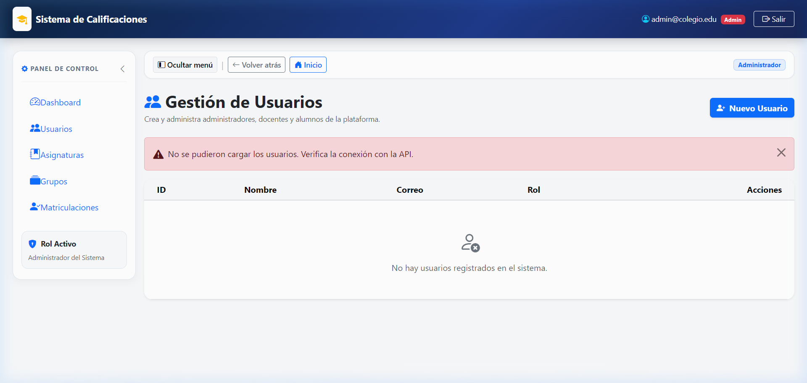

* **¿Para qué sirve?:** Permite dar de alta, consultar y dar de baja a cualquier usuario que participe en la plataforma.
* **Paso a paso para crear un nuevo usuario:**
  1. Haga clic en el botón azul **+ Nuevo Usuario**.
  2. Complete el formulario emergente (Modal):
     - **Nombre Completo:** (Ejemplo: `Prof. Roberto Mendoza` o `Camila Salazar`).
     - **Correo Electrónico:** (Ejemplo: `roberto.mendoza@colegio.edu`).
     - **Contraseña:** Clave de acceso inicial asignada.
     - **Rol en el Sistema:** Seleccione entre *Administrador*, *Maestro* o *Estudiante*.
  3. Haga clic en **Guardar Usuario**. El nuevo usuario se registrará en la base de datos y aparecerá de inmediato en la tabla con su respectiva etiqueta de color.
* **Paso a paso para eliminar un usuario:**
  1. Localice la fila del usuario en la tabla.
  2. Haga clic en el botón rojo **Eliminar**.
  3. Confirme la advertencia de seguridad del navegador.

> [!NOTE]
> No se puede eliminar a un usuario que posea registros dependientes asociados (por ejemplo, un maestro con grupos activos o un estudiante con calificaciones vigentes) para preservar la integridad referencial de la base de datos.

---

### 4.3 Gestión de Asignaturas
Ruta: `/admin/asignaturas`

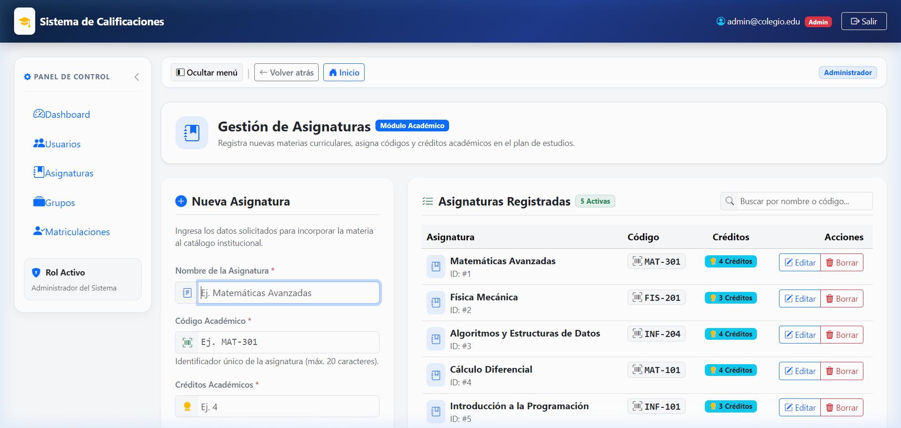

* **¿Para qué sirve?:** Diseña y mantiene el catálogo curricular oficial de la institución. En esta vista coexisten en pantalla compartida el formulario de registro y la tabla de materias existentes.
* **Paso a paso para registrar una asignatura:**
  1. Diríjase a la columna izquierda **Nueva Asignatura**.
  2. Ingrese los datos obligatorios:
     - **Nombre de la Asignatura:** (Ejemplo: `Estructuras de Datos y Algoritmos`, `Física Cuántica`).
     - **Código Académico:** Identificador institucional alfanumérico (Ejemplo: `INF-204`, `MAT-301`). El sistema lo formatea automáticamente a mayúsculas.
     - **Créditos Académicos:** Valor ponderado de la materia (Ejemplo: `4`).
  3. Haga clic en **Guardar Asignatura**.
  4. La materia se insertará de inmediato y la tabla de la derecha se actualizará mostrando el contador actualizado.
* **Funcionalidades de búsqueda y edición:**
  - **Buscador en tiempo real:** Escriba en la caja superior derecha cualquier término (por nombre o código) para filtrar instantáneamente el catálogo.
  - **Editar Asignatura:** Haga clic en el botón **Editar** para corregir el nombre, código o créditos en un modal interactivo.
  - **Eliminar Asignatura:** Haga clic en **Borrar** para remover materias obsoletas.

---

### 4.4 Gestión de Grupos Académicos
Ruta: `/admin/grupos`

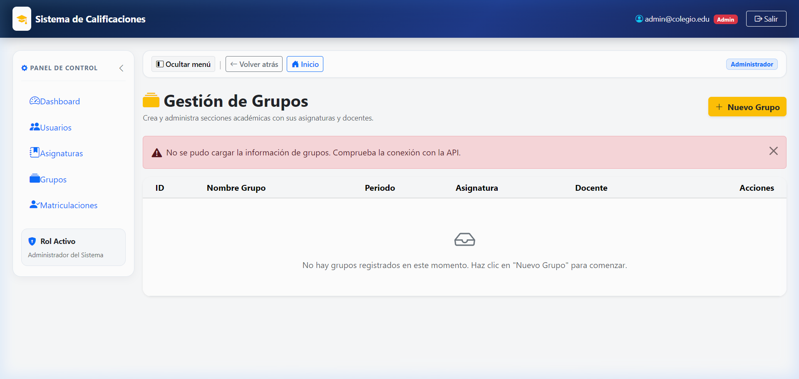

* **¿Para qué sirve?:** Vincula una materia del catálogo con un periodo escolar específico y asigna formalmente al docente titular responsable de impartirla.
* **Paso a paso para crear un grupo:**
  1. Haga clic en el botón amarillo **+ Nuevo Grupo**.
  2. En el modal emergente complete:
     - **Nombre del Grupo:** Nomenclatura del aula o sección (Ejemplo: `Grupo 101-A`, `Sección B-Matutino`).
     - **Periodo Académico:** Ciclo lectivo (Ejemplo: `2026-1`, `2026-2`).
     - **Asignatura:** Seleccione del menú desplegable la materia curricular a impartir.
     - **Docente / Maestro:** Seleccione de la lista únicamente a los usuarios con rol de *Maestro*.
  3. Haga clic en **Guardar Grupo**.
* **Ejemplo Práctico:**
  - Crear el grupo `MAT-101-B` para el periodo `2026-1`, con la asignatura `Matemáticas Avanzadas` y asignado al profesor `Carlos Ramírez`. Una vez creado, este curso aparecerá automáticamente en el portal del profesor asignado.

---

### 4.5 Gestión de Matriculaciones (Inscripciones)
Ruta: `/admin/inscripciones`

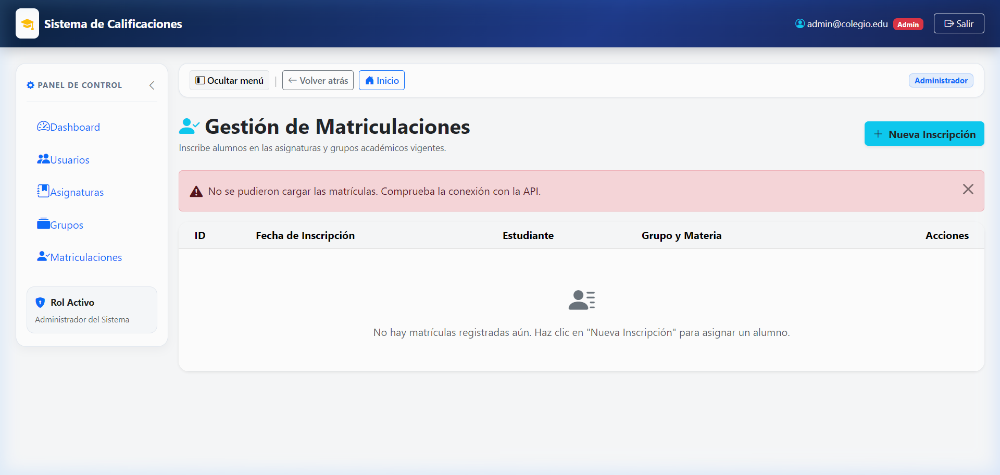

* **¿Para qué sirve?:** Matricula oficialmente a los estudiantes en sus correspondientes secciones académicas para que puedan ser evaluados por los docentes.
* **Paso a paso para matricular a un estudiante:**
  1. Haga clic en el botón celeste **+ Nueva Inscripción**.
  2. En el formulario emergente seleccione:
     - **Estudiante:** Seleccione al alumno de la lista desplegable (filtrada solo por rol Estudiante).
     - **Grupo:** Seleccione la sección deseada (muestra el nombre del grupo, materia y periodo).
  3. Haga clic en **Guardar Matrícula**.
* **Desmatricular Alumno:**
  - En caso de baja o cambio de comisión, localice al alumno y pulse **Desmatricular**.

---

## 👨‍🏫 5. Módulo del Docente (Maestro)

El Docente es el actor principal en la conducción académica, encargado de formular las actividades de aprendizaje y evaluar el progreso de los estudiantes a su cargo.

### 5.1 Panel del Docente (Teacher Dashboard)
Ruta: `/maestro`

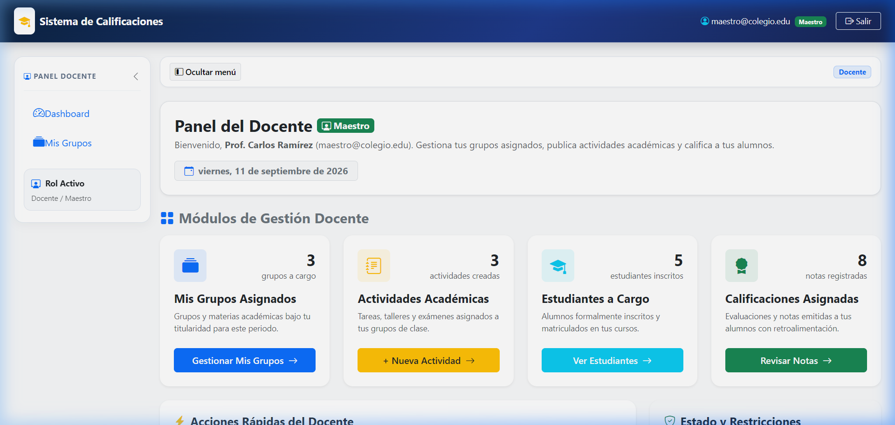

* **¿Para qué sirve?:** Centro de control del profesor donde monitorea sus métricas docentes y accede rápidamente a sus funciones evaluativas.
* **Métricas Clave:**
  1. **Mis Grupos Asignados:** Secciones bajo la titularidad del docente logueado.
  2. **Actividades Académicas:** Total de tareas, talleres y exámenes vigentes.
  3. **Estudiantes a Cargo:** Conteo de alumnos únicos inscritos en sus materias.
  4. **Calificaciones Asignadas:** Evaluaciones y notas emitidas con retroalimentación.
* **Acciones Rápidas del Docente:**
  - **+ Crear Nueva Actividad:** Despliega un formulario rápido para publicar una tarea en cualquiera de sus grupos.
  - **Consultar Alumnos:** Abre un modal con el listado consolidado de estudiantes matriculados con selector de filtro por grupo.
  - **Revisar Notas:** Navega directamente a las actividades pendientes por calificar.

---

### 5.2 Mis Grupos Asignados
Ruta: `/maestro/mis-grupos`

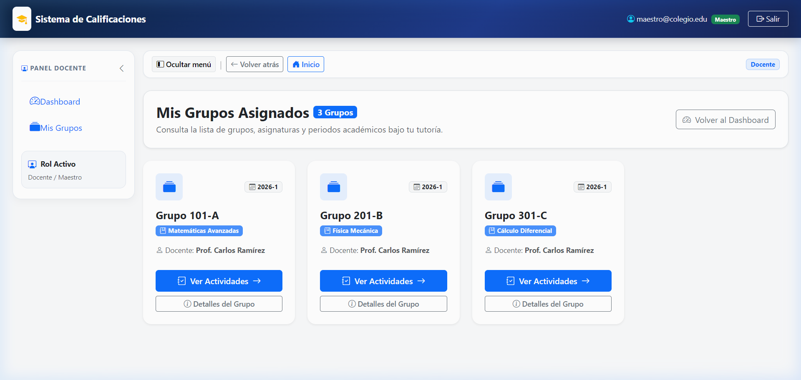

* **¿Para qué sirve?:** Vista en tarjetas estilizadas de todos los cursos y asignaturas asignadas al maestro para el periodo escolar.
* **Detalles mostrados en cada tarjeta:**
  - Nombre del Grupo (Ej. `Grupo 101-A`).
  - Periodo académico lectivo (`2026-1`).
  - Nombre de la asignatura con insignia destacada.
  - Nombre del profesor titular.
* **Botones de Acción en cada tarjeta:**
  - **Ver Actividades:** Abre la ficha del grupo directamente en la pestaña de tareas y evaluaciones.
  - **Detalles del Grupo:** Conduce a la información de aula, horarios e inscripciones.

---

### 5.3 Ficha Detallada del Grupo y Gestión de Actividades
Ruta: `/maestro/grupo/:id`

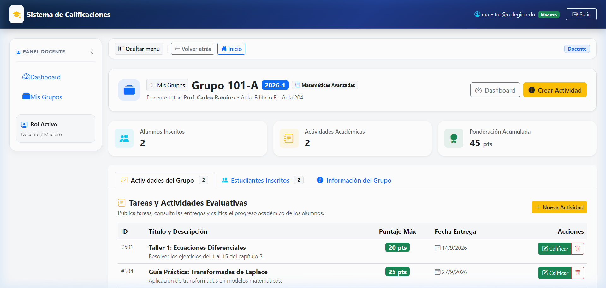

Esta vista integra tres pestañas interactivas indispensables:

#### Pestaña 1: Actividades del Grupo
* Lista todas las tareas, talleres o exámenes creados específicamente para este grupo.
* **Paso a paso para crear una actividad evaluativa:**
  1. Haga clic en el botón amarillo **+ Nueva Actividad**.
  2. Complete los campos requeridos:
     - **Título:** Nombre claro de la asignación (Ejemplo: `Taller 1: Ecuaciones Diferenciales` o `Proyecto Final: Base de Datos`).
     - **Descripción:** Instrucciones, enunciados o criterios de entrega.
     - **Puntuación Máxima:** Valor total ponderado (Ejemplo: `20` o `100` puntos).
     - **Fecha Límite de Entrega:** Fecha calendario estipulada para el cierre.
  3. Pulse **Guardar Actividad**. La tarea aparecerá de inmediato en la tabla con sus puntos máximos e identificador.

#### Pestaña 2: Estudiantes Inscritos
* Presenta el padrón oficial de alumnos matriculados en esa comisión, con sus correos electrónicos institucionales y fecha de alta.

#### Pestaña 3: Información del Grupo (Ficha Técnica)
* Muestra datos de infraestructura: aula física asignada (Ejemplo: `Edificio B - Aula 204`), turnos, horarios semanales y resumen de carga académica.

---

### 5.4 Calificación y Retroalimentación de Entregas
Ruta: `/maestro/actividad/:id`

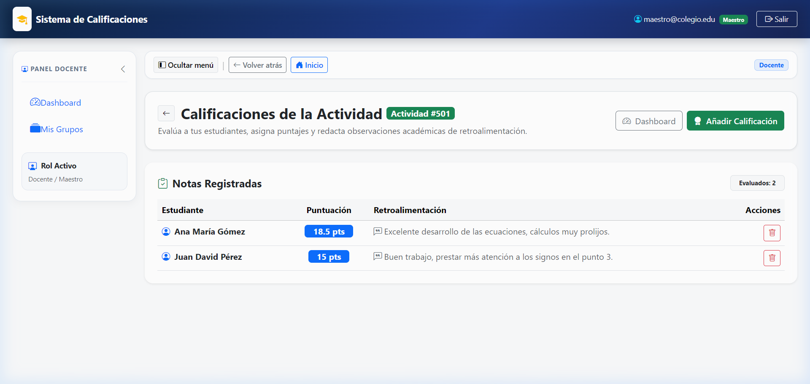

* **¿Para qué sirve?:** Permite al docente calificar el desempeño de cada estudiante de manera individual, asignando un puntaje numérico y una retroalimentación formativa cualitativa.
* **Paso a paso para evaluar a un estudiante:**
  1. Desde la tabla de actividades del grupo o del dashboard, pulse el botón verde **Calificar**.
  2. Haga clic en el botón superior **Añadir Calificación**.
  3. Complete el formulario de evaluación:
     - **Estudiante:** Seleccione al alumno que entregó la tarea.
     - **Puntuación Obtenida:** Ingrese la nota obtenida (Ejemplo: `18.5` sobre `20`).
     - **Comentarios y Retroalimentación:** Redacte comentarios constructivos (Ejemplo: *"Excelente desarrollo de los métodos analíticos, cálculos muy ordenados. Repasar signos en el ejercicio 3"*).
  4. Haga clic en **Guardar Calificación**.
* **Visualización de Notas:** La calificación se publica instantáneamente y estará disponible en el portal del estudiante calificado.

---

## 🎒 6. Módulo del Estudiante (Alumno)

El Estudiante cuenta con un entorno claro, amigable y transparente para consultar su situación académica, verificar sus calificaciones y contactar a sus docentes.

### 6.1 Portal del Estudiante (Student Dashboard)
Ruta: `/estudiante`

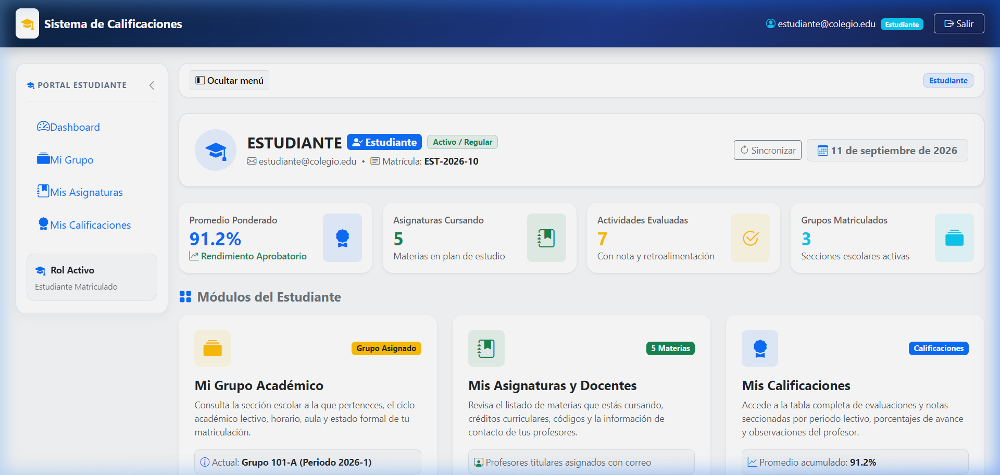

* **¿Para qué sirve?:** Ficha general de identificación y resumen académico del alumno logueado.
* **Tarjeta de Perfil:** Muestra el nombre del alumno, correo institucional, número de matrícula única oficial (Ejemplo: `EST-2026-0010`) y su condición de *Activo / Regular*.
* **Tarjetas de Rendimiento y Avance:**
  1. **Promedio Ponderado:** Porcentaje general acumulado con indicador de estado (*Aprobatorio* o *En Riesgo*).
  2. **Asignaturas Cursando:** Número de materias activas en el plan de estudios.
  3. **Actividades Evaluadas:** Tareas corregidas por los docentes con nota asignada.
  4. **Grupos Matriculados:** Secciones académicas en las que participa el alumno.
* **Módulos Directos de Acceso:** Tres tarjetas interactivas que dirigen a *Mi Grupo*, *Mis Asignaturas* y *Mis Calificaciones*.

---

### 6.2 Mi Grupo Académico
Ruta: `/estudiante/grupo`

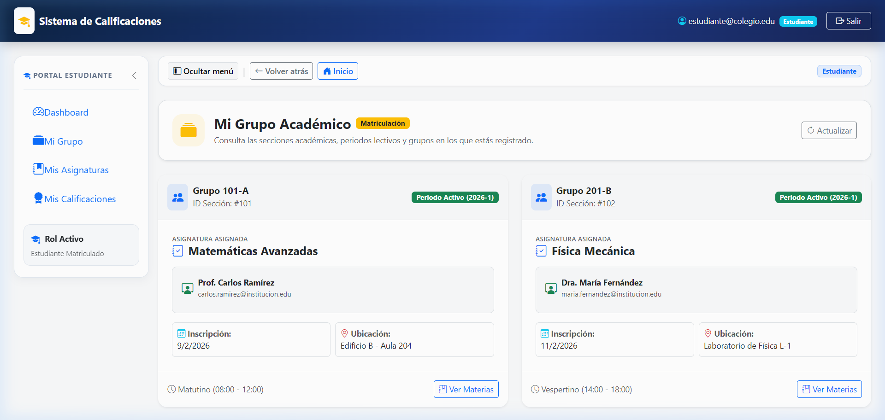

* **¿Para qué sirve?:** Brinda certeza al estudiante sobre en qué aula física cursa, qué sección le corresponde y qué profesor está asignado.
* **Información que visualiza el estudiante:**
  - Denominación de la sección escolar (Ejemplo: `Grupo 101-A`).
  - Materia asignada al grupo.
  - Periodo lectivo vigente (`Periodo Activo (2026-1)` o ciclos anteriores concluidos).
  - Docente tutor y correo de contacto.
  - Fecha formal de matrícula y ubicación física (Ejemplo: `Edificio B - Aula 204`).
  - Turno de clases (Ejemplo: `Matutino (08:00 - 12:00)`).

---

### 6.3 Mis Asignaturas y Contacto Docente
Ruta: `/estudiante/asignaturas`

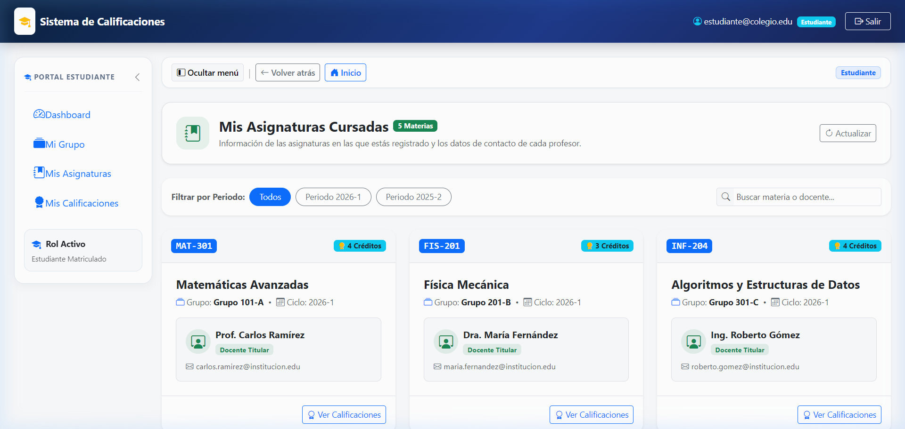

* **¿Para qué sirve?:** Directorio completo de todas las materias inscritas por el alumno en su carrera o ciclo escolar.
* **Herramientas de Filtrado y Búsqueda:**
  - **Filtro por Periodo:** Píldoras para alternar entre *Todos*, *Periodo 2026-1* o *Periodo 2025-2*.
  - **Buscador:** Búsqueda en tiempo real por nombre de la materia, código o nombre del profesor.
* **Información disponible por materia:**
  - Código curricular oficial (Ejemplo: `MAT-301`, `INF-204`).
  - Número de créditos otorgados (Ejemplo: `4 Créditos`).
  - Tarjeta del Docente Titular con enlace directo (`mailto:`) para enviar correos electrónicos al profesor ante cualquier consulta académica.
  - Botón directo **Ver Calificaciones** para ir al boletín de notas.

---

### 6.4 Mis Calificaciones e Historial de Evaluaciones
Ruta: `/estudiante/calificaciones`

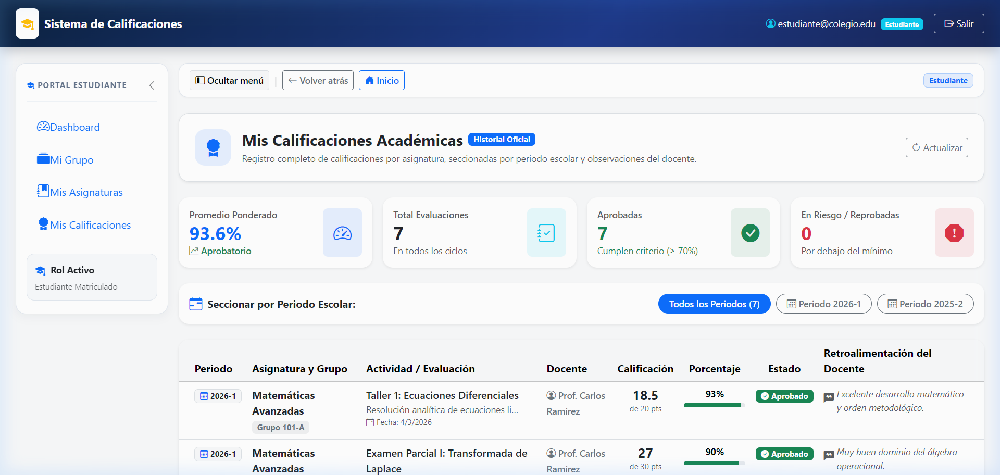

* **¿Para qué sirve?:** Boletín de calificaciones oficial del alumno. Es el módulo de mayor consulta por parte de los estudiantes.
* **Resumen Métrico Superior:**
  - **Promedio Ponderado:** Rendimiento porcentual del periodo seleccionado.
  - **Total Evaluaciones:** Tareas o exámenes evaluados.
  - **Aprobadas:** Cantidad de evaluaciones con nota igual o superior al 70%.
  - **En Riesgo / Reprobadas:** Evaluaciones con nota inferior al criterio mínimo aprobatorio.
* **Selector por Periodo:** Permite aislar las calificaciones del ciclo lectivo actual o consultar notas históricas de semestres anteriores.
* **Tabla de Calificaciones Detallada:**
  - **Periodo:** Insignia del ciclo lectivo.
  - **Asignatura y Grupo:** Nombre de la materia y comisión.
  - **Actividad / Evaluación:** Título, descripción y fecha de entrega.
  - **Docente:** Profesor que emitió la evaluación.
  - **Calificación:** Puntaje obtenido vs. Puntuación máxima (Ejemplo: `18.5 de 20 pts`).
  - **Porcentaje Visual:** Barra de progreso interactiva verde si es aprobatorio (>= 70%) o roja si no lo es.
  - **Estado Oficial:** Insignia de *Aprobado*, *Reprobado* o *En Espera* (pendiente de calificación).
  - **Retroalimentación del Docente:** Texto completo de las observaciones formuladas por el profesor para orientar al estudiante.

---

## 🔄 7. Flujo Operativo Integrado del Ciclo Escolar

El siguiente diagrama ilustra la secuencia lógica con la que interactúan los tres roles a lo largo de un ciclo académico:

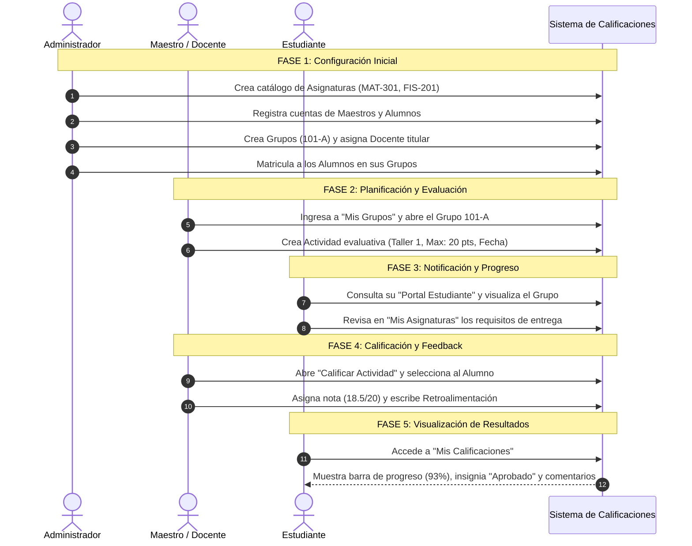

---

## ❓ 8. Preguntas Frecuentes y Solución de Problemas

### 1. ¿Qué hago si olvidé mi contraseña de acceso?
* Si no recuerda sus credenciales, contacte al Administrador del sistema. Desde el módulo **Gestión de Usuarios**, el Administrador puede restablecer o actualizar su contraseña de forma inmediata.
* Para pruebas locales o demostraciones institucionales, utilice los botones de **Acceso Rápido por Rol** disponibles en la pantalla de inicio de sesión.

### 2. Al intentar eliminar una asignatura o un grupo, el sistema arroja error. ¿A qué se debe?
* El sistema previene la corrupción de datos mediante integridad referencial. Si un grupo ya contiene estudiantes matriculados o actividades creadas con calificaciones históricas, no podrá eliminarse hasta desvincular o desmatricular dichos registros previos.

### 3. ¿Un estudiante puede modificar sus notas o actividades?
* **No.** El rol de estudiante tiene permisos estrictos de solo lectura sobre sus asignaturas, grupos y calificaciones. Solo el maestro asignado formalmente a la materia tiene permisos de escritura y edición sobre las notas.

### 4. ¿Un maestro puede calificar a estudiantes de otros cursos?
* **No.** Cada profesor únicamente visualiza y administra los grupos en los cuales ha sido designado como docente titular por el Administrador.

---

*Documentación técnica y operativa elaborada para el repositorio del Sistema de Calificaciones.*
