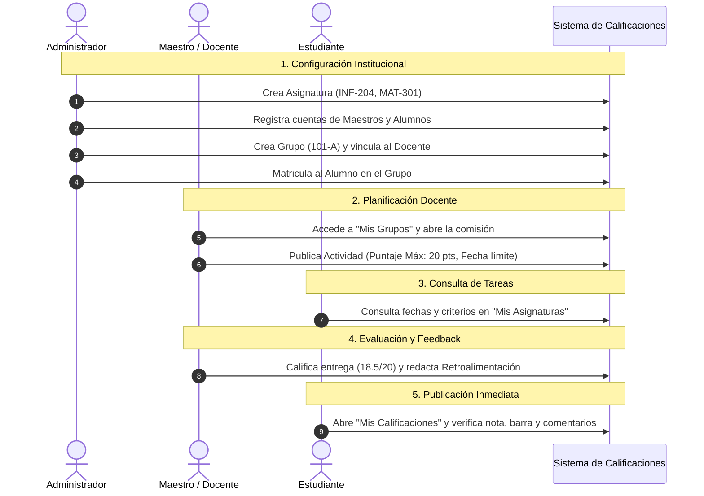

# 🎓 Sistema de Gestión y Calificaciones Académicas

[](https://react.dev/)
[](https://dotnet.microsoft.com/)
[](https://learn.microsoft.com/ef/core/)
[](https://www.microsoft.com/sql-server)
[](https://getbootstrap.com/)
[](https://jwt.io/)

Plataforma integral y moderna diseñada para digitalizar, centralizar y optimizar todos los procesos formativos y de evaluación continua en instituciones educativas. Permite la administración total de usuarios, catálogo de asignaturas, apertura de grupos académicos, matriculación de alumnos, formulación de actividades evaluativas, asignación de notas con retroalimentación cualitativa y consulta de calificaciones por parte de los estudiantes.

---

## 📑 Tabla de Contenidos
1. [Objetivo General del Sistema](#-1-objetivo-general-del-sistema)
2. [Requisitos Previos](#-2-requisitos-previos)
3. [Instalación y Puesta en Marcha](#-3-instalación-y-puesta-en-marcha)
   - [3.1 Clonar el Repositorio](#31-clonar-el-repositorio)
   - [3.2 Configuración y Ejecución del Backend (.NET Web API)](#32-configuración-y-ejecución-del-backend-net-web-api)
   - [3.3 Configuración y Ejecución del Frontend (React + Vite)](#33-configuración-y-ejecución-del-frontend-react--vite)
4. [Cuentas de Demostración y Acceso Rápido](#-4-cuentas-de-demostración-y-acceso-rápido)
5. [Medidas y Estándares de Seguridad Implementados](#-5-medidas-y-estándares-de-seguridad-implementados)
6. [Matriz de Permisos por Rol](#-6-matriz-de-permisos-por-rol)
7. [Manual Detallado de Uso por Roles](#-7-manual-detallado-de-uso-por-roles)
   - [7.1 Inicio de Sesión y Autenticación](#71-inicio-de-sesión-y-autenticación)
   - [7.2 Rol Administrador (Admin)](#72-rol-administrador-admin)
   - [7.3 Rol Docente (Maestro)](#73-rol-docente-maestro)
   - [7.4 Rol Estudiante (Alumno)](#74-rol-estudiante-alumno)
8. [Diagrama del Ciclo de Vida Académico](#-8-diagrama-del-ciclo-de-vida-académico)
9. [Estructura del Proyecto](#-9-estructura-del-proyecto)
10. [Preguntas Frecuentes y Soporte](#-10-preguntas-frecuentes-y-soporte)

---

## 🎯 1. Objetivo General del Sistema

El **Sistema de Calificaciones Académicas** resuelve los desafíos de dispersión de información, lentitud en el reporte de notas y falta de comunicación directa entre docentes y alumnos mediante:

* **Gestión Centralizada:** Un solo punto de control para la directiva escolar donde se organizan materias, secciones y usuarios.
* **Evaluación Continua y Transparente:** Los maestros definen actividades con ponderación clara (puntos máximos y fechas límite) y aportan retroalimentación constructiva.
* **Autonomía para el Estudiante:** Visualización inmediata de promedios ponderados, estado aprobatorio y desglose pormenorizado de notas por periodo escolar.
* **Seguridad y Privacidad:** Control de Acceso Basado en Roles (RBAC) con protección criptográfica JWT.

---

## 💻 2. Requisitos Previos

Antes de ejecutar el proyecto, asegúrate de tener instalado en tu equipo:

1. **[.NET SDK 8.0](https://dotnet.microsoft.com/download)** o superior.
2. **[Node.js](https://nodejs.org/)** versión 18.x o 20.x LTS (incluye `npm`).
3. **[SQL Server](https://www.microsoft.com/sql-server)** (SQL Server Express, Developer Edition o LocalDB).
4. **[Git](https://git-scm.com/)** para el control de versiones.
5. *(Opcional)* **[Entity Framework Core CLI Tool](https://learn.microsoft.com/ef/core/cli/dotnet)**:
   ```bash
   dotnet tool install --global dotnet-ef
   ```

---

## 🚀 3. Instalación y Puesta en Marcha

Sigue estos sencillos pasos para tener el sistema funcionando en tu entorno local:

### 3.1 Clonar el Repositorio

```bash
git clone https://github.com/Emerson-1111/Sistema-Calificaciones.git
cd Sistema-Calificaciones
```

---

### 3.2 Configuración y Ejecución del Backend (.NET Web API)

1. **Navega a la carpeta del proyecto backend:**
   ```bash
   cd SC-API/SC-API
   ```

2. **Configurar la Cadena de Conexión:**
   Abre el archivo `appsettings.Development.json` (o copia `appsettings.Example.json` como `appsettings.json`) y verifica la cadena de conexión `DefaultConnection` para que apunte a tu instancia local de SQL Server:
   ```json
   {
     "ConnectionStrings": {
       "DefaultConnection": "Server=localhost\\SQLEXPRESS;Database=SistemaCalificaciones;Integrated Security=True;TrustServerCertificate=True"
     },
     "origenesPermitidos": "http://localhost:5173,http://localhost:5174"
   }
   ```
   > **Nota para SQL Server LocalDB:** Si utilizas LocalDB, puedes emplear:  
   > `"DefaultConnection": "Server=(localdb)\\mssqllocaldb;Database=SistemaCalificaciones;Trusted_Connection=True;MultipleActiveResultSets=true"`

3. **Restaurar paquetes NuGet:**
   ```bash
   dotnet restore
   ```

4. **Aplicar Migraciones a la Base de Datos:**
   Aplica las migraciones preconfiguradas para generar automáticamente las tablas (`Usuarios`, `Roles`, `Asignaturas`, `Grupos`, `Inscripciones`, `Actividades`, `Calificaciones`):
   ```bash
   dotnet ef database update
   ```

5. **Iniciar la API de backend:**
   ```bash
   dotnet run
   ```
   La API quedará escuchando peticiones en:
   * **HTTPS:** `https://localhost:7137`
   * **HTTP:** `http://localhost:5242`
   * **Documentación Swagger UI:** `https://localhost:7137/swagger`

---

### 3.3 Configuración y Ejecución del Frontend (React + Vite)

1. **Abre una nueva terminal y navega al directorio del frontend:**
   ```bash
   cd react-sc
   ```

2. **Configurar Variables de Entorno:**
   Copia el archivo de plantilla `.env.example` como `.env`:
   ```bash
   cp .env.example .env
   ```
   Asegúrate de que coincida con la URL de tu API backend:
   ```env
   VITE_API_URL=https://localhost:7137/api
   ```

3. **Instalar dependencias de Node.js:**
   ```bash
   npm install
   ```

4. **Ejecutar el servidor de desarrollo:**
   ```bash
   npm run dev
   ```

5. **Abrir en el Navegador:**
   Ingresa a: **`http://localhost:5173`**

---

## 👥 4. Cuentas de Demostración y Acceso Rápido

Para facilitar la evaluación inmediata de cada rol sin necesidad de registrar datos manualmente, la pantalla de inicio de sesión (`/login`) cuenta con botones de **Acceso Rápido por Rol**:

| Rol | Botón de Acceso Rápido | Correo Demostrativo | Perfil y Alcance |
| :--- | :---: | :--- | :--- |
| **Administrador** | 🔴 `Admin` | `admin@colegio.edu` | Control total del sistema, gestión de usuarios, catálogo y grupos. |
| **Docente** | 🟢 `Maestro` | `maestro@colegio.edu` | Gestión de cursos a cargo, publicación de tareas y calificación de alumnos. |
| **Estudiante** | 🔵 `Estudiante` | `estudiante@colegio.edu` | Consulta de materias cursadas, grupo asignado y boletín oficial de notas. |

---

## 🔒 5. Medidas y Estándares de Seguridad Implementados

El proyecto fue auditado y preparado siguiendo estrictas medidas de seguridad y privacidad:

1. **Exclusión Rigurosa en `.gitignore`:**
   - Se excluyen carpetas de compilación `.NET` (`bin/`, `obj/`, archivos `.pdb`, `.dll`).
   - Se excluyen configuraciones de usuario de Visual Studio (`.vs/`, `*.user`, `*.suo`).
   - Se excluyen dependencias pesadas de Node (`node_modules/`, `dist/`).
   - Se protegen archivos de entorno con variables locales o secretos (`.env`, `.env.local`), distribuyendo únicamente plantillas seguras (`.env.example`, `appsettings.Example.json`).
2. **Protección de Datos Privados y Nombres de Host:**
   - La cadena de conexión de desarrollo utiliza `localhost\\SQLEXPRESS` estándar, sin exponer hostnames o identificadores de hardware privados.
3. **Autenticación Basada en Tokens JWT:**
   - El backend valida el emisor (`Issuer`), la audiencia (`Audience`) y la firma criptográfica (`SymmetricSecurityKey`) en cada solicitud protegida con expiración automática de 2 horas.
4. **Integridad Referencial y Borrado Restringido:**
   - En `ApplicationDbContext`, las relaciones críticas (*Maestro -> Grupo*, *Estudiante -> Inscripcion*, *Estudiante -> Calificacion*) están protegidas con `DeleteBehavior.Restrict` para evitar pérdidas involuntarias de datos en cascada.
5. **Políticas CORS Parametrizadas:**
   - Solo los orígenes autorizados especificados en la configuración (`http://localhost:5173`, etc.) pueden consumir los endpoints del servicio.

---

## 📊 6. Matriz de Permisos por Rol

| Módulo / Capacidad | Administrador (`Admin`) | Maestro (`Maestro`) | Estudiante (`Estudiante`) |
| :--- | :---: | :---: | :---: |
| **Dashboard Global de Métricas** | ✅ Total | ❌ | ❌ |
| **Crear y Dar de Baja Usuarios** | ✅ Total | ❌ | ❌ |
| **Gestionar Catálogo de Asignaturas** | ✅ Total | ❌ | ❌ |
| **Crear Grupos y Asignar Maestros** | ✅ Total | ❌ | ❌ |
| **Matricular y Desmatricular Alumnos** | ✅ Total | ❌ | ❌ |
| **Dashboard Docente y Consulta de Alumnos** | ✅ Total | ✅ Solo sus grupos | ❌ |
| **Crear Actividades y Ponderaciones** | ❌ | ✅ Solo sus grupos | ❌ |
| **Asignar Calificaciones y Retroalimentación** | ❌ | ✅ Solo sus grupos | ❌ |
| **Consultar Compañeros e Instalaciones** | ✅ Total | ✅ Solo sus grupos | ✅ Su sección |
| **Consultar Boletín de Calificaciones** | ❌ | ❌ | ✅ Exclusivo Alumno |
| **Directorio de Contacto Docente** | ✅ Total | ❌ | ✅ Sus profesores |

---

## 📖 7. Manual Detallado de Uso por Roles

### 7.1 Inicio de Sesión y Autenticación
Ruta: `/login`


* **Propósito:** Autenticar al usuario y redirigirlo automáticamente al panel correspondiente según sus privilegios.
* **Instrucciones:**
  1. Ingrese su correo institucional registrado y contraseña.
  2. Presione **Ingresar al Sistema**.
  3. Alternativamente, utilice los botones de acceso rápido de prueba ubicados al pie de la tarjeta.

---

### 7.2 Rol Administrador (Admin)

#### A. Panel de Control (Dashboard Admin)
Ruta: `/admin`


* **Propósito:** Ofrece una panorámica ejecutiva del ciclo escolar con métricas en tiempo real: usuarios registrados, asignaturas curriculares activas, grupos conformados y total de matrículas. Incluye botones de acceso directo a cada acción operativa.

#### B. Gestión de Usuarios
Ruta: `/admin/usuarios`


* **Propósito:** Crear, listar y dar de baja a cualquier integrante de la institución.
* **Pasos para crear un usuario:**
  1. Presione **+ Nuevo Usuario**.
  2. Complete: Nombre Completo (ej: *Prof. Roberto Mendoza*), Correo Electrónico (ej: *roberto.mendoza@colegio.edu*), Contraseña y Rol en el sistema (*Administrador*, *Maestro* o *Estudiante*).
  3. Pulse **Guardar Usuario**.

#### C. Gestión de Asignaturas
Ruta: `/admin/asignaturas`


* **Propósito:** Mantiene el catálogo oficial de materias curriculares.
* **Pasos para crear una asignatura:**
  1. En el formulario lateral ingrese el **Nombre de la Asignatura** (ej: *Algoritmos y Estructuras de Datos*), **Código Académico** (ej: *INF-204*, formateado automáticamente en mayúsculas) y **Créditos Académicos** (ej: *4*).
  2. Presione **Guardar Asignatura**.
  3. Utilice la barra de búsqueda en tiempo real de la derecha para filtrar el catálogo por código o materia.

#### D. Gestión de Grupos Académicos
Ruta: `/admin/grupos`


* **Propósito:** Crear secciones académicas para un ciclo escolar, vinculando una materia curricular con el maestro titular responsable.
* **Pasos para crear un grupo:**
  1. Presione **+ Nuevo Grupo**.
  2. Indique el **Nombre del Grupo** (ej: *Grupo 101-A*), **Periodo Académico** (ej: *2026-1*), seleccione la **Asignatura** y el **Docente** titular.
  3. Presione **Guardar Grupo**.

#### E. Gestión de Matriculaciones
Ruta: `/admin/inscripciones`


* **Propósito:** Asignar formalmente a los estudiantes a sus secciones académicas correspondientes para que formen parte de la lista evaluable.
* **Pasos para matricular:**
  1. Presione **+ Nueva Inscripción**.
  2. Seleccione el **Estudiante** y el **Grupo** deseado.
  3. Pulse **Guardar Matrícula**.

---

### 7.3 Rol Docente (Maestro)

#### A. Panel del Docente (Teacher Dashboard)
Ruta: `/maestro`


* **Propósito:** Tablero de mando del profesor con el recuento de sus grupos asignados, tareas publicadas, alumnos únicos a cargo y notas emitidas.
* **Funciones:**
  - Botón **+ Crear Nueva Actividad** para publicar tareas de manera expedita.
  - Botón **Consultar Alumnos** con filtro por comisiones para visualizar las listas de clase.

#### B. Mis Grupos Asignados
Ruta: `/maestro/mis-grupos`


* **Propósito:** Catálogo visual en tarjetas de todas las asignaturas asignadas al maestro para el ciclo vigente. Permite ingresar directamente al plan de actividades o a los detalles de aula e infraestructura.

#### C. Ficha del Grupo y Gestión de Actividades
Ruta: `/maestro/grupo/:id`


Organizado en 3 pestañas principales:
1. **Actividades del Grupo:** Publicación y control de evaluaciones. Para formular una nueva tarea, presione **+ Nueva Actividad**, defina el *Título* (ej: *Taller 1: Ecuaciones Diferenciales*), *Descripción*, *Puntuación Máxima* (ej: *20 pts*) y *Fecha Límite*.
2. **Estudiantes Inscritos:** Listado de los alumnos formalmente matriculados en la sección.
3. **Información del Grupo:** Ficha técnica con aula asignada, turnos y carga ponderada total.

#### D. Calificación y Retroalimentación
Ruta: `/maestro/actividad/:id`


* **Propósito:** Calificar de forma individual las entregas de los estudiantes e incorporar comentarios formativos cualitativos.
* **Pasos para calificar:**
  1. Presione **Añadir Calificación**.
  2. Seleccione el estudiante a calificar.
  3. Ingrese la **Puntuación Obtenida** (ej: *18.5* sobre *20*).
  4. Redacte la **Retroalimentación** con observaciones de mejora o aciertos.
  5. Pulse **Guardar Calificación**. El resultado se publicará al instante en el portal del alumno.

---

### 7.4 Rol Estudiante (Alumno)

#### A. Portal del Estudiante (Student Dashboard)
Ruta: `/estudiante`


* **Propósito:** Ficha de identidad del alumno con su matrícula institucional (`EST-2026-0010`), carrera y estado regular. Presenta las métricas de promedio acumulado, materias cursadas y accesos directos.

#### B. Mi Grupo Académico
Ruta: `/estudiante/grupo`


* **Propósito:** Permite al alumno conocer los detalles de su aula física (ej: *Edificio B - Aula 204*), turnos, horarios y datos del profesor titular a cargo de su sección.

#### C. Mis Asignaturas y Contacto Docente
Ruta: `/estudiante/asignaturas`


* **Propósito:** Directorio curricular de todas las materias inscritas por el estudiante.
* **Características:**
  - Filtro interactivo por periodo lectivo (*2026-1*, *2025-2* o *Todos*).
  - Buscador de materias y profesores.
  - Tarjeta de contacto de cada docente con enlace directo vía correo institucional (`mailto:`).

#### D. Mis Calificaciones e Historial de Evaluaciones
Ruta: `/estudiante/calificaciones`


* **Propósito:** Boletín digital de notas del alumno con desglose detallado de cada evaluación.
* **Métricas y Visualización:**
  - **Promedio Ponderado:** Porcentaje general del periodo seleccionado.
  - **Conteo de Rendimiento:** Desglose de evaluaciones *Aprobadas* (&ge; 70%) y *En Riesgo*.
  - **Tabla de Evaluaciones:** Muestra la materia, actividad, puntaje obtenido vs. puntaje máximo, **barra de progreso porcentual**, estado (*Aprobado*, *Reprobado* o *En Espera*) y las observaciones completas de retroalimentación emitidas por el profesor.

---

## 🔄 8. Diagrama del Ciclo de Vida Académico



---

## 📁 9. Estructura del Proyecto

```text
Sistema-Calificaciones/
│
├── .gitignore                         # Reglas de exclusión para .NET, Node y secretos
├── README.md                          # Documentación principal del repositorio
├── GUIA_DE_USO.md                     # Guía y manual detallado de operaciones
│
├── docs/
│   └── screenshots/                   # Capturas de pantalla reales de todos los módulos
│       ├── login_page.png
│       ├── admin_dashboard.png
│       ├── admin_usuarios.png
│       ├── admin_asignaturas.png
│       ├── admin_grupos.png
│       ├── admin_inscripciones.png
│       ├── maestro_dashboard.png
│       ├── maestro_mis_grupos.png
│       ├── maestro_grupo_detalle.png
│       ├── maestro_actividad_calificar.png
│       ├── estudiante_dashboard.png
│       ├── estudiante_mi_grupo.png
│       ├── estudiante_mis_asignaturas.png
│       └── estudiante_mis_calificaciones.png
│
├── SC-API/                            # Backend en ASP.NET Core Web API (.NET)
│   ├── SC-API.slnx                    # Solución de Visual Studio
│   └── SC-API/
│       ├── Controllers/               # Endpoints REST (Auth, Usuarios, Grupos, etc.)
│       ├── Entidades/                 # Modelos EF Core (Usuario, Rol, Calificación, etc.)
│       ├── DTOs/                      # Data Transfer Objects
│       ├── Migrations/                # Migraciones históricas de EF Core
│       ├── ApplicationDbContext.cs    # Configuración de contexto y relaciones DB
│       ├── Program.cs                 # Pipeline HTTP, CORS, DI y JWT Bearer
│       ├── appsettings.json           # Configuración base de la aplicación
│       ├── appsettings.Development.json # Configuración de desarrollo local
│       └── appsettings.Example.json   # Plantilla de configuración sin datos sensibles
│
└── react-sc/                          # Frontend en React 19 + Vite + Bootstrap
    ├── src/
    │   ├── api/                       # Instancia Axios con interceptores JWT
    │   ├── context/                   # AuthContext (login, logout, decodificación token)
    │   ├── pages/
    │   │   ├── admin/                 # Vistas y componentes del Administrador
    │   │   ├── teacher/               # Vistas y componentes del Docente
    │   │   ├── student/               # Vistas y componentes del Alumno
    │   │   └── auth/                  # Pantalla de Login y acceso rápido
    │   ├── App.jsx                    # Enrutamiento protegido por roles
    │   └── main.jsx                   # Punto de entrada de React
    ├── .env.example                   # Plantilla de variables de entorno para el frontend
    └── package.json                   # Dependencias y scripts de Vite
```

---

## 💬 10. Preguntas Frecuentes y Soporte

* **¿Cómo recupero una contraseña si no puedo iniciar sesión?**  
  El Administrador del sistema puede cambiar la contraseña de cualquier cuenta desde el módulo *Gestión de Usuarios*. Para pruebas inmediatas, utiliza los botones de acceso rápido de la pantalla de login.
* **¿Qué hacer si aparece un error al intentar eliminar un grupo o materia?**  
  Por seguridad e integridad referencial de la base de datos, no se permite eliminar grupos que tengan alumnos ya matriculados o notas asentadas. Debe desmatricular a los estudiantes previamente.
* **¿Los estudiantes pueden editar sus calificaciones?**  
  No. El rol de Estudiante posee permisos estrictos de solo lectura. Solo el docente asignado a la asignatura tiene facultades para asentar o modificar calificaciones.

---

*Desarrollado con ❤️ para la modernización de la gestión académica institucional.*
